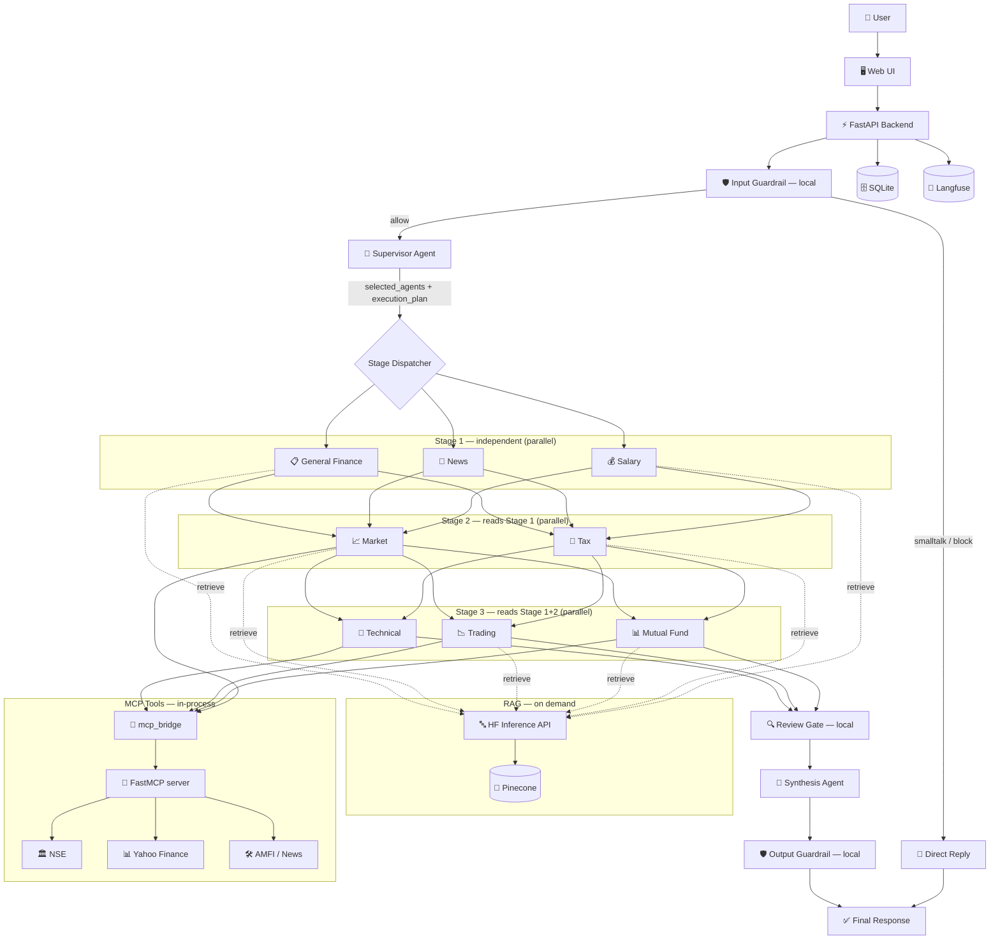

# FinSage AI — Multi-Agent Indian Financial Intelligence

FinSage AI is a multi-agent financial assistant for Indian users. It answers practical
questions on stocks, indices, options and F&O, mutual funds, income tax and GST, salary
planning, insurance, loans and retirement — using LangGraph orchestration, live exchange
data, and retrieval-augmented context.

A **Supervisor Agent** decides which specialists to run, agents exchange data through a
**shared state bus**, a **Review gate** validates the results, and a **Synthesis Agent**
turns everything into one human answer.

**One process, one command:**

```bash
python main.py
```

MCP tools run in-memory inside the backend — there is no second server to start.

> Educational and informational use only. FinSage is not a SEBI-registered investment advisor.

---

## Features

| | |
|---|---|
| **Supervisor planning** | An LLM picks the agents per query instead of keyword routing |
| **Parallel stages** | Independent agents inside a stage run concurrently |
| **In-memory MCP** | FastMCP in-process: ~2ms per tool call, no port, no SSE hop |
| **Live NSE data** | Exchange-native quotes for indices *and* equities, plus real option chains (OI, IV, PCR, max pain) |
| **NeMo guardrails** | NVIDIA NeMo rails driving local Python actions — no extra LLM call |
| **Pinecone + HF embeddings** | Managed vector store, API embeddings, no local model or index |
| **Langfuse telemetry** | Per-agent generations with token usage, **USD cost** and quality scores |
| **Review gate** | Local validation of completeness and cross-agent contradictions |
| **Single service** | FastAPI serves both the REST API and the chat UI |
| **Deploy-ready** | `render.yaml` blueprint, free-tier tuned, no secrets in the repo |

---

## Architecture



### Request lifecycle

1. **Input guardrail** — local checks. Small talk and refusals short-circuit here.
2. **Supervisor** — picks agents, extracts entities, writes an execution plan.
3. **Stages 1→3** — agents run, later stages reading earlier stages' output.
4. **Review gate** — scores data completeness, flags contradictions. No LLM call.
5. **Synthesis** — one answer in a human voice.
6. **Output guardrail** — softens certainty language, guarantees a disclaimer.

---

## Agents and Models

Three Groq tiers, defined in `config/models.py`:

| Tier | Model | Used by |
|------|-------|---------|
| `GROQ_FAST` | `llama-3.1-8b-instant` | Supervisor, News sentiment |
| `GROQ_STANDARD` | `llama-3.3-70b-versatile` | Market, Salary, General Finance, **Synthesis** |
| `GROQ_REASONING` | `openai/gpt-oss-120b` | Tax, Technical, Trading, Mutual Fund |

> **Groq retires model IDs without notice.** A retired ID returns HTTP 404, which agents
> catch and turn into placeholder text — the pipeline keeps "working" while producing
> nothing useful. See [Troubleshooting](#answers-say-analysis-could-not-be-completed).

| Agent | Stage | Writes | Reads |
|-------|-------|--------|-------|
| Salary | 1 | `salary_analysis` | — |
| News | 1 | `news_analysis` | — |
| General Finance | 1 | `general_finance_result` | — |
| Tax | 2 | `tax_analysis` | `salary_analysis` |
| Market | 2 | `market_analysis` | `news_analysis` |
| Mutual Fund | 3 | `mf_analysis` | `salary` + `tax` + `market` |
| Trading | 3 | `trading_analysis_output` | `market_analysis` |
| Technical | 3 | `technical_analysis` | — |
| Review | 4 | `review_output` | all of the above |
| Synthesis | 5 | `recommendation`, `confidence` | everything |

### Shared state bus

Agents never call each other. All communication goes through typed keys in
`FinSageState` (`agents/state.py`).

Because agents within a stage run **in parallel**, each gets a shallow copy of the state
and only its own output key is merged back — concurrent writes cannot clobber each other.
RAG context is additive and folded in across branches.

---

## Data Sources

The NSE/Yahoo split is deliberate — each covers what the other cannot:

| Data | Source | Notes |
|------|--------|-------|
| Index quotes | **NSE** `/api/allIndices` | NIFTY, BANKNIFTY, SENSEX… |
| Equity quotes | **NSE** `/api/NextApi/...getSymbolData` | Needs `marketType=N`; returns sector, P/E, delivery %, volatility |
| Option chain | **NSE** `/api/option-chain-v3` | Requires `&expiry=`; Yahoo has **no** Indian options data |
| Fundamentals | **Yahoo** | ROE, debt/equity, margins, beta — not exposed by NSE |
| Historical OHLCV | **Yahoo** | Feeds the technical indicators |
| Mutual funds | **AMFI** via `mftool` | NAV, category, trailing returns |
| News | RSS feeds | Headline sentiment |

**NSE requires a browser TLS fingerprint.** It sits behind Akamai, which rejects plain
`requests` with 403 on the homepage itself. `curl_cffi` with `impersonate="chrome"` is
required, not optional.

---

## RAG Pipeline

```
query -> HF Inference API (384-dim embedding) -> Pinecone (cosine, top_k) -> chunks
```

- **Model:** `sentence-transformers/all-MiniLM-L6-v2` — 384 dimensions
- **Embeddings:** Hugging Face Inference API only. There is **no local model** by design,
  so an outage surfaces immediately instead of being silently masked.
- **Store:** Pinecone, dimension 384, metric cosine. Chunk text lives in vector metadata,
  so there is no side file that can drift out of sync with the vectors.
- **Caching:** whole retrievals are cached, not just embeddings — several agents hit RAG
  within one query, and repeats resolve in ~0ms.

Retrieval results are explicitly **sorted by score**: serverless Pinecone gathers matches
across shards and does not always return them globally sorted, and agents truncate the
context they receive — so the strongest chunk has to be first or it can be cut off.

Endpoint note: the legacy `api-inference.huggingface.co` host was retired and no longer
resolves. The current path is `router.huggingface.co/hf-inference/...`.

---

## Guardrail Policy

Rails are defined in `guardrails/rails.co` and executed by **NVIDIA NeMo Guardrails**
(`agents/nemo_rails.py`). They dispatch deterministic Python actions rather than NeMo's
stock `self_check_*` prompts, so the policy below costs **no extra LLM generation** — the
reason v4 originally dropped NeMo still holds, without giving up the rails engine.
`/api/health` reports which engine is live; if NeMo fails to load, a local fallback keeps
the policy enforced and says so there.

| Input | Behaviour |
|-------|-----------|
| "hi", "what can you do?", "thanks", "bye" | Answered directly with a friendly reply |
| Any finance question | Passed to the full pipeline |
| Ambiguous / finance-adjacent | **Passed** — a false block is worse than a false allow |
| Hacking, malware, credential theft | Blocked |
| Money-laundering / tax-evasion how-to | Blocked (questions *about* the law are allowed) |
| Prompt injection | Blocked |
| Clearly off-topic (poems, recipes, trivia) | Blocked |

On output, certainty language ("guaranteed returns", "100% safe") is **rewritten** and a
disclaimer is guaranteed — rather than discarding an otherwise good answer.

Verify with `python scripts/test_guardrails.py`.

---

## Tech Stack

- Python 3.10+ (3.12 pinned for deploys)
- FastAPI + Uvicorn — serves API **and** UI
- LangGraph + LangChain
- Groq API
- NVIDIA NeMo Guardrails — input/output rails
- FastMCP — in-memory transport
- Pinecone — vector store
- Hugging Face Inference API — embeddings
- Langfuse v4 — telemetry, cost and scores
- curl_cffi — NSE access
- SQLite + SQLAlchemy — query logs
- Render — Blueprint deploy

---

## Repository Structure

```text
render.yaml                 # Render Blueprint (repo root, rootDir: finsage)

finsage/
    main.py                 # FastAPI backend - THE entrypoint (API + UI)
    app.py                  # Thin launcher alias (honours PORT, for HF Spaces)
    mcp_server.py           # FastMCP server definition (tool functions)
    mcp_bridge.py           # In-memory MCP client for sync agent code
    llm.py                  # Instrumented + pooled Groq client (import this, not groq)
    observability.py        # Langfuse wiring: trace(), score(), callbacks
    requirements.txt

    agents/
        state.py            # FinSageState TypedDict (shared bus)
        graph.py            # LangGraph StateGraph, parallel stages
        guardrail.py        # Local guardrails + small-talk replies
        supervisor_agent.py # Planner and agent selector
        rag_agent.py        # On-demand retrieval with query expansion
        review_agent.py     # Local validation gate (no LLM call)
        salary_agent.py         # Stage 1
        news_agent.py           # Stage 1
        general_finance_agent.py# Stage 1
        tax_agent.py            # Stage 2
        market_agent.py         # Stage 2
        mutual_fund_agent.py    # Stage 3
        trading_agent.py        # Stage 3
        technical_agent.py      # Stage 3
        synthesis_agent.py      # Final answer

    rag/
        embedder.py         # HF Inference API embeddings (no local model)
        vector_store.py     # Pinecone client and queries
        knowledge_base.py   # Retrieval + result cache
        docs/               # Source .txt knowledge files

    tools/
        nse_tool.py         # NSE quotes (index + equity) and option chain
        yahoo_tool.py       # Fundamentals, intraday, historical OHLCV
        mf_tool.py          # AMFI mutual fund data
        news_tool.py        # RSS headlines
        technical_tool.py   # EMA / RSI / MACD calculations

    api/                    # Routes: /chat, /health, /history
    config/                 # Settings and Groq model IDs
    db/                     # SQLite setup and CRUD
    frontend/static/        # HTML/CSS/JS chat UI
    scripts/                # ingest_docs, test_query, test_guardrails, verify_imports
```

---

## Setup

### 1. Virtual environment

```powershell
python -m venv venv
.\venv\Scripts\Activate.ps1
```

```bash
python3 -m venv venv && source venv/bin/activate
```

### 2. Dependencies

```bash
pip install -r requirements.txt
```

### 3. Environment

Create `.env` in the `finsage/` directory:

```env
GROQ_API_KEY=gsk_your_key_here

# Embeddings - required for RAG (HF API only, no local model)
HUGGINGFACE_KEY=hf_your_key_here
EMBEDDING_MODEL=sentence-transformers/all-MiniLM-L6-v2
EMBEDDING_DIM=384

# Vector store - index MUST be dimension 384, metric cosine
PINECONE_API_KEY=pcsk_your_key_here
PINECONE_INDEX_NAME=finsage
PINECONE_NAMESPACE=

# Optional - Langfuse telemetry
LANGFUSE_PUBLIC_KEY=pk-lf-...
LANGFUSE_SECRET_KEY=sk-lf-...
LANGFUSE_HOST=https://cloud.langfuse.com
```

`LANGFUSE_BASE_URL` is accepted as an alias for `LANGFUSE_HOST`. Use the host matching
your project's region (`https://us.cloud.langfuse.com` for US) — the wrong region
authenticates successfully but records nothing.

See `.env.example` for the full list including tuning knobs.

### 4. Load the knowledge base

```bash
python scripts/ingest_docs.py
```

Flags:

```bash
python scripts/ingest_docs.py --clear         # wipe the namespace, then ingest
python scripts/ingest_docs.py --create-index  # create the Pinecone index if missing
```

Chunk ids are deterministic (`<file>-<n>`), so a plain re-run updates records in place
instead of accumulating duplicates.

Re-ingest whenever `rag/docs/` changes. If you change `EMBEDDING_MODEL`, you must also
recreate the Pinecone index with the new dimension — a mismatch is rejected at ingest.

---

## Running

```powershell
cd "E:\AI_Agent\finance agent\finsage"
..\env\Scripts\Activate.ps1
python main.py
```

The port follows `PORT` when it is set and defaults to 8000 otherwise, so the same entry
point works locally and on Render.

- UI — http://localhost:8000
- API docs — http://localhost:8000/docs
- Health — http://localhost:8000/api/health

Startup takes ~5s: it opens the MCP in-memory session, the Pinecone connection, the HF
embedding session, and verifies Langfuse credentials, so the first user query pays none
of that cost.

### Exposing MCP tools externally (optional)

```bash
python mcp_server.py
```

Serves the same tools over stdio for Claude Desktop or MCP Inspector. The backend does
not need this.

---

## API

**POST** `/api/chat`

```json
{ "user_id": "string", "query": "string" }
```

```json
{ "answer": "string", "confidence": 95, "intent": "tax", "trace": ["..."] }
```

**GET** `/api/health`

```json
{
  "status": "ok",
  "version": "0.5.0",
  "architecture": "supervisor-staged-parallel",
  "mcp_transport": "in-memory (fastmcp)",
  "mcp_connected": true,
  "mcp_tools": ["nse_quote", "stock_data", "company_profile", "intraday_data",
                "options_chain", "market_status", "mf_details", "market_news"],
  "langfuse_enabled": true,
  "rag": {
    "vector_store": "pinecone",
    "index": "finsage",
    "connected": true,
    "vectors": 118,
    "embedding_model": "sentence-transformers/all-MiniLM-L6-v2",
    "embedding_dim": 384,
    "embedding_source": "huggingface-api"
  }
}
```

**GET** `/api/history/{user_id}` — the user's recent queries.

---

## Scripts

| Script | Purpose |
|--------|---------|
| `scripts/ingest_docs.py` | Embed `rag/docs/` and upsert into Pinecone |
| `scripts/test_query.py` | Run queries through the graph without a server |
| `scripts/test_guardrails.py` | Assert the guardrail policy |
| `scripts/verify_imports.py` | Check every agent module imports and the graph compiles |

```bash
python scripts/test_query.py                              # standard set
python scripts/test_query.py "How much tax on 3L LTCG?"   # ad-hoc
```

---

## Observability

With Langfuse keys present, every `/api/chat` call is traced as `finsage_query`. Startup
logs `[OK] Langfuse telemetry active` and `/api/health` reports `langfuse_enabled`.

If credentials are missing or wrong, initialisation logs a warning and the app continues
without tracing — telemetry never fails a user request.

### Every model call is a priced generation

All Groq traffic goes through `llm.py`, **not** the `groq` SDK directly. This matters:
the LangChain callback handler only instruments LangChain/LangGraph runnables, so calling
`groq` from an agent produces graph spans (CHAIN, TOOL) and no GENERATION at all — which
leaves Model Usage, Model Costs and User Consumption permanently empty.

`llm.py` is a drop-in replacement (`from llm import Groq`) that additionally:

| | |
|---|---|
| **Emits a generation per call** | Named per agent (`tax_llm`, `synthesis_llm`, …) with model, input and output |
| **Reports token usage** | `usage_details` from Groq's own response |
| **Computes cost** | Langfuse has no price table for Groq, so USD comes from `GROQ_PRICING` in `config/models.py` |
| **Pools connections** | One client per API key instead of a fresh TLS handshake inside every agent's `run()` |
| **Bounds each call** | 20s timeout (`GROQ_TIMEOUT_SECONDS`); previously a Groq call could hang with no deadline |
| **Flags empty completions** | A reasoning model that exhausts `max_tokens` on hidden thinking returns HTTP 200 with no text — logged as WARNING instead of silently becoming an empty analysis |

Update `GROQ_PRICING` if Groq changes its rates; nothing else needs to change.

### Trace attribution and scores

`observability.trace()` owns the root span so that `propagate_attributes()` can stamp
`user_id` and `session_id` onto **every child span**. Langfuse aggregations only count
observations that carry the attribute — setting it on the root alone is why per-user cost
reporting stays blank.

Three scores are written per request, from data the pipeline already computes:

| Score | Source |
|-------|--------|
| `confidence` | Review gate's data-quality score, 0–1 |
| `review_approved` | Whether the review gate passed |
| `latency_seconds` | Wall-clock for the graph run |

> **SDK note.** This code targets **Langfuse v4** (`langfuse>=4.0.0`). v4 removed
> `update_current_trace` and `start_as_current_span`; the current API is
> `start_observation(as_type=...)` plus `propagate_attributes()`. Because every telemetry
> call is wrapped in `try/except` so it can never break a request, using a v3 SDK does not
> raise — tracing just silently stops. Hence the hard version floor in `requirements.txt`.

### Parallel stages and trace nesting

Agents inside a stage run in a `ThreadPoolExecutor`, and Langfuse v4 traces through
OpenTelemetry, whose context is **thread-local**. `agents/graph.py` therefore captures the
OTEL context and re-attaches it inside each worker thread. Without that, every generation
from a parallel agent starts its own orphan root trace instead of nesting under
`finsage_query`.

---

## Performance

Measured end-to-end through `/api/chat` on a warm local instance:

| Path | Typical |
|------|---------|
| Small talk / blocked | ~1.6s (skips the pipeline entirely) |
| Two agents (market + technical) | ~11s |
| Three to four agents (salary + tax + MF) | 22 – 24s |
| MCP tool call | ~2ms (in-memory) |
| NSE quote | 0.1 – 0.4s |
| RAG retrieval | ~540ms cold, ~0ms cached |
| Startup | ~5s |

End-to-end latency is dominated by Groq generation. The stage split exists so independent
agents overlap rather than serialise, but a multi-agent query is still **five sequential
LLM round trips** — supervisor → stage 1 → stage 2 → stage 3 → synthesis — because later
stages read earlier stages' output. That pipeline shape, not per-call tuning, is what sets
the floor on a complex query.

### Where the latency went

Three fixes came out of reading the Langfuse latency percentiles:

- **The p99 was a timeout, not slow work.** A ~45s p99 matched `_AGENT_TIMEOUT_SECONDS`
  exactly: Groq calls had **no timeout at all**, so one stalled agent held its stage open
  until the stage deadline expired. Calls now cap at 20s and the stage ceiling is 25s, so a
  stall is abandoned while the rest of the stage still returns.
- **A TLS handshake per call.** `Groq(api_key=...)` was constructed inside every agent's
  `run()`, so all ~5 calls in a request opened a new connection. Clients are now pooled per
  key in `llm.py`.
- **Hidden reasoning burning the token budget.** The reasoning agents were hitting
  `max_tokens=2000` on *every* run — meaning their analysis was truncated mid-sentence
  every time, after paying for the full budget. `mutual_fund`, `trading` and `technical`
  now use `reasoning_effort="low"` at a 1200 cap (~2.9s instead of ~5.1s), which still
  produces more text than synthesis actually reads. **Tax deliberately keeps full
  reasoning** — its arithmetic is the output users are most likely to check.

Note that synthesis truncates each agent's contribution (700–1100 chars) before using it,
so raising an agent's `max_tokens` buys latency and cost without changing the final answer.

---

## Deploying to Render

`render.yaml` at the **repository root** is a Blueprint. The application lives in
`finsage/`, which is what the blueprint's `rootDir` points at.

```text
finance agent/          <- repository root, git remote, render.yaml
├── render.yaml
├── README.md
└── finsage/            <- rootDir: the app
    ├── main.py
    └── requirements.txt
```

### Deploy

1. Push the repo to GitHub.
2. Render Dashboard → **New** → **Blueprint** → select the repo.
3. Render reads `render.yaml` and prompts for the five secrets below.
4. Deploy. First build takes several minutes (pandas, numpy and nemoguardrails).

### Secrets to paste

Everything else is already set in `render.yaml`. Only these five are marked
`sync: false`, meaning Render prompts for them and stores them encrypted — they are
deliberately **not** in the committed file. Copy the values from your local `finsage/.env`:

| Variable | Where it comes from |
|----------|--------------------|
| `GROQ_API_KEY` | console.groq.com |
| `HUGGINGFACE_KEY` | huggingface.co — Inference API token |
| `PINECONE_API_KEY` | app.pinecone.io |
| `LANGFUSE_PUBLIC_KEY` | Langfuse project settings |
| `LANGFUSE_SECRET_KEY` | Langfuse project settings |

`LANGFUSE_BASE_URL` is preset to `https://us.cloud.langfuse.com`. **Change it if your
Langfuse project is not in the US region** — the wrong region authenticates successfully
and then records nothing.

### What the blueprint does and why

| Setting | Reason |
|---------|--------|
| `startCommand: uvicorn … --port $PORT` | Render assigns the port at runtime; a hardcoded 8000 fails its port scan and the deploy is marked unhealthy |
| `--workers 1` | The free instance has 512 MB. A second worker duplicates pandas/numpy/langchain/nemoguardrails and gets OOM-killed. In-request concurrency already comes from the parallel stage executor |
| `healthCheckPath: /api/health` | Always returns 200 — it catches its own errors, so a Pinecone hiccup degrades the reported status instead of failing the deploy |
| `PYTHONUNBUFFERED=1` | Otherwise Python block-buffers stdout when it is a pipe and the whole startup banner never reaches the Render log, making a healthy boot look hung |
| `region: singapore` | Closest free region to the NSE/AMFI feeds this app polls on most queries. Switch to `oregon` if your account cannot place a free instance there |
| `GROQ_TIMEOUT_SECONDS=25` | Slightly above the local default — free instances share CPU and cold-start, so the first request after a spin-up needs headroom |

Nothing is installed on the instance beyond `requirements.txt`: embeddings come from the
Hugging Face API and vectors live in Pinecone, so there is no model cache or local index
to fit in 512 MB.

### Free-tier limitations you should expect

- **The service spins down after ~15 minutes of inactivity.** The next request pays a cold
  start of roughly a minute before FinSage's own ~5s warmup even begins.
- **The filesystem is ephemeral — there are no persistent disks on the free plan.**
  `finsage.db` is recreated empty on every deploy and every spin-up, so `/api/history`
  only reflects the current instance's lifetime. Conversation memory is in-process and
  resets the same way. Attach a disk on a paid plan, or move to Postgres, if query logs
  need to survive.
- **Shared CPU** makes the reasoning-tier agents noticeably slower than the local numbers
  in [Performance](#performance).
- Pinecone, Groq, Hugging Face and Langfuse are all external, so their own free-tier
  limits apply independently of Render's.

### Verifying a deploy

```bash
curl https://<your-service>.onrender.com/api/health
```

Expect `status: ok` with `langfuse_enabled`, `mcp_connected` and `rag.connected` all true
and a non-zero `rag.vectors`. If `rag.vectors` is 0, the Pinecone index is empty — run
`python scripts/ingest_docs.py` locally against the same index, since ingestion is not
part of the build.

---

## Troubleshooting

### Answers say analysis "could not be completed"

Almost always a retired Groq model ID returning HTTP 404. List what is live:

```python
from groq import Groq
print([m.id for m in Groq(api_key="...").models.list().data])
```

Then update `config/models.py`.

### Every NSE call returns 403

NSE fingerprints the TLS handshake. `curl_cffi` is required:

```bash
pip install curl_cffi
```

Without it `nse_tool.py` falls back to plain `requests` and most calls fail.

### NSE endpoints suddenly 404

NSE versions and retires paths without notice. Already retired:
`/api/quote-equity` (403, WAF-blocked), `/api/equity-stockIndices` (404),
`/api/option-chain-indices` (404).

Read the current endpoints out of NSE's own JS bundle:

```python
import re
from curl_cffi import requests as cr

s = cr.Session(impersonate="chrome")
s.get("https://www.nseindia.com")
html = s.get("https://www.nseindia.com/get-quotes/equity?symbol=RELIANCE").text

for js in re.findall(r'src="([^"]+\.js[^"]*)"', html):
    url = js if js.startswith("http") else "https://www.nseindia.com" + js
    print(set(re.findall(r'/api/[A-Za-z0-9\-_/]+', s.get(url).text)))
```

### RAG returns "Knowledge base unavailable" or "is empty"

Check `/api/health` → `rag` first: it reports the Pinecone connection and live vector count.

- `vectors: 0` → run `python scripts/ingest_docs.py`
- `connected: false` → check `PINECONE_API_KEY` and `PINECONE_INDEX_NAME`
- Embedding errors → verify the HF key and endpoint:

```python
from rag.embedder import embed_query
print(embed_query("test").shape)   # -> (1, 384)
```

A dimension mismatch between `EMBEDDING_MODEL` and the Pinecone index raises at ingest
rather than corrupting the store.

### Langfuse dashboard is empty

1. `/api/health` → `langfuse_enabled: true`?
2. Does `LANGFUSE_HOST` / `LANGFUSE_BASE_URL` match your project's region? The wrong
   region authenticates successfully and records nothing.
3. Check `[Langfuse]` warnings in the startup log.

### Traces appear, but Model Costs / Model Usage / User Consumption are empty

Symptom: traces contain CHAIN and TOOL observations but **zero GENERATIONs**.

That means model calls are bypassing the instrumentation. The LangChain callback handler
cannot see raw `groq` SDK calls — only LangChain/LangGraph runnables. Check that every
agent imports the wrapper, not the SDK:

```bash
grep -rn "^from groq import Groq" agents/    # should return nothing
grep -rn "^from llm import Groq"   agents/    # should list every agent
```

If generations exist but cost is `$0`, the model is missing from `GROQ_PRICING` in
`config/models.py` — Langfuse does not price Groq models on its own.

If cost is present but **User Consumption** is empty, `user_id` is not reaching the child
spans. Aggregations only count observations carrying the attribute, so the request must go
through `observability.trace()`, which applies `propagate_attributes()` before the graph runs.

### Scores panel is empty

Scores are written after the graph completes, using the `trace_id` yielded by
`observability.trace()`. If that context manager is bypassed the id is `None` and
`score()` silently returns. Confirm with `langfuse_enabled: true` and check for
`[Langfuse] score … skipped` at debug level.

### Analysis from Tax / Mutual Fund / Trading comes back blank

A reasoning-tier model with `reasoning_format="hidden"` bills its hidden thinking as
completion tokens. If `max_tokens` is too low the budget is consumed **before any visible
text is emitted** — the API returns HTTP 200 with empty content and `finish_reason:
"length"`. Measured on `openai/gpt-oss-120b`: any cap at or below ~900 returns zero visible
characters.

Do not lower `max_tokens` on these agents below ~1200 without checking the visible output.
`llm.py` flags such calls as WARNING in Langfuse so they are visible rather than silent.

---

## Version History

### v6 — Telemetry that reports, and deployment

- **Model calls are actually traced.** Every agent called the raw `groq` SDK, which the
  LangChain callback handler cannot see, so traces contained graph spans and **zero
  generations** — leaving Model Usage, Model Costs and User Consumption permanently empty.
  All Groq traffic now goes through `llm.py`, which emits a named generation per agent.
- **Cost reporting.** Langfuse ships no price table for Groq, so token counts alone still
  showed `$0`. Cost is computed from `GROQ_PRICING` and sent as `cost_details`.
- **Per-user attribution.** `propagate_attributes()` stamps `user_id`/`session_id` on every
  child span; Langfuse aggregations ignore observations without it, which is why per-user
  cost was blank even when traces carried a user.
- **Scores.** `confidence`, `review_approved` and `latency_seconds` are written per request
  from values the pipeline already computed.
- **Fixed Langfuse v4 API drift (again).** `update_current_trace` and
  `start_as_current_span` do not exist in v4; the code called both and, because telemetry
  is exception-wrapped, failed silently. `requirements.txt` now floors at `langfuse>=4.0.0`.
- **Fixed orphan traces from parallel stages.** OpenTelemetry context is thread-local and
  does not follow work into a `ThreadPoolExecutor`, so each parallel agent's generations
  started their own root trace. `graph.py` now propagates the context into workers.
- **Latency.** Groq calls had no timeout, which is what produced a ~45s p99 equal to the
  stage deadline; calls now cap at 20s and the stage at 25s. Groq clients are pooled
  instead of rebuilt per agent. `mutual_fund`, `trading` and `technical` moved to
  `reasoning_effort="low"` after measuring that they were truncating at `max_tokens` on
  every run; **tax keeps full reasoning** for arithmetic accuracy.
- **Empty completions are visible.** A reasoning model can exhaust `max_tokens` on hidden
  thinking and return HTTP 200 with no text; `llm.py` flags that as WARNING rather than
  letting an empty analysis flow silently into synthesis.
- **Render Blueprint.** `render.yaml` at the repo root, free-tier tuned (`$PORT` binding,
  single worker, unbuffered logs), with all five credentials as dashboard-prompted secrets
  so nothing sensitive is committed.

### v5 — Pinecone

- **Pinecone replaces FAISS.** Chunk text lives in vector metadata, so `chunks.pkl` and
  `faiss.index` are gone along with the drift risk between them.
- **Local embedding model removed.** Embeddings come from Hugging Face only; the 175MB
  `model_cache/`, `sentence-transformers` and `faiss-cpu` are dropped.
- **Retrieval results sorted by score** — serverless Pinecone does not guarantee ordering.
- `/api/health` now reports RAG status.

### v4 — Latency and correctness

- **Local guardrails** replace NeMo Guardrails — removed two full LLM generations per
  query and fixed conversational openers being wrongly refused.
- **Parallel stage execution** — independent agents no longer wait on each other.
- **In-memory MCP** replaces the SSE server — no second process, no startup race.
- **Local review gate** replaces an LLM critic call.
- **Fixed the dead reasoning model** — `qwen/qwen3-32b` had been retired, silently
  breaking the Tax, Technical, Trading and Mutual Fund agents.
- **Live NSE option chain** replaces a Yahoo path that returned empty for every Indian
  symbol.
- **NSE equity quotes restored** via `curl_cffi` and the current `NextApi` endpoint.
- **Fixed Langfuse** — the SDK v2 import paths did not exist in v4, so tracing silently
  no-oped, and the host env var was being read from the wrong name.
- **Fixed HF embeddings** — the configured endpoint host had been retired and no longer
  resolved, so every retrieval failed silently.
- **Voice mode removed** (STT/TTS/VAD) — the product is text-only.
- **Confidence** is computed from the review gate instead of being printed by the model
  inside the answer.

### v3 — Supervisor architecture

Supervisor planning, dependency-staged execution, review gate, and shared state bus
replaced the original `Intent → Route → Synthesize` pipeline.

---

## License and Disclaimer

Provided for educational purposes. This is not certified financial advice. Always consult
a qualified financial advisor before making investment decisions.
