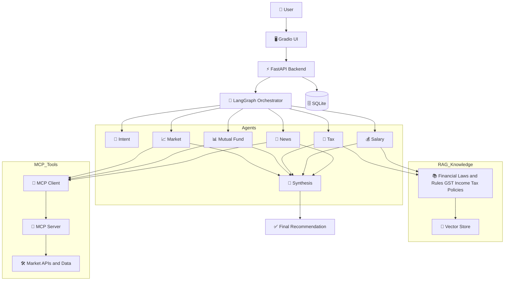

# FinSage AI: Indian Financial Assistant

FinSage AI is a multi-agent financial assistant for Indian users. It answers practical questions on stocks, indices, mutual funds, tax, salary planning, insurance, loans, retirement, and trading using a LangGraph agent workflow, live market tools, and retrieval-augmented context.

The project supports two execution styles:

1. Local multi-process mode: run FastAPI, MCP server, and Gradio separately.
2. Hugging Face Spaces single-entry mode: run app.py, which orchestrates all required services.

Important: this project is for educational and informational use only. It is not SEBI-registered investment advice.

## Features

- Multi-agent orchestration with LangGraph
- FastAPI backend with structured API responses
- Gradio chat UI with example prompts, confidence score, trace, and recent history
- MCP server integration for tool invocation
- RAG-backed context for tax and finance rules
- Local persistence for query logs via SQLite

## High-Level Architecture



## Tech Stack

- Python 3.10+
- FastAPI + Uvicorn
- Gradio
- LangGraph + LangChain
- Groq API
- MCP (SSE)
- FAISS + sentence-transformers
- SQLite + SQLAlchemy

## Repository Structure

```text
finsage/
    app.py                  # HF Spaces entrypoint (orchestrates MCP + backend + UI)
    main.py                 # FastAPI backend entrypoint
    mcp_server.py           # MCP server
    mcp_client.py           # Optional MCP test client
    requirements.txt
    README.md

    agents/                 # LangGraph nodes and state
    api/                    # FastAPI routes
    config/                 # Settings and model config
    db/                     # Database setup and CRUD
    frontend/               # Gradio UI implementation
    rag/                    # Embedding + FAISS knowledge base
    tools/                  # Financial tool integrations
    scripts/                # Utility scripts (ingest/test)
```

## API Contract

Primary chat endpoint:

- POST /api/chat
- Request body:

```json
{
    "user_id": "string",
    "query": "string"
}
```

- Response body:

```json
{
    "answer": "string",
    "confidence": 0,
    "intent": "string",
    "trace": []
}
```


## Local Setup

### 1. Clone and enter project

```bash
cd "finance agent/finsage"
```

### 2. Create and activate virtual environment

Windows:

```powershell
python -m venv venv
.\venv\Scripts\Activate.ps1
```

Linux/macOS:

```bash
python3 -m venv venv
source venv/bin/activate
```

### 3. Install dependencies

```bash
pip install -r requirements.txt
```

### 4. Configure environment

Create .env in the project root:

```env
GROQ_API_KEY=gsk_your_key_here
```

### 5. Build RAG index (first run only)

```bash
python scripts/ingest_docs.py
```

## Run Modes

### Mode A: Standard local (3 terminals)

Terminal 1 (backend):

```powershell
cd "e:\AI_Agent\finance agent\finsage"
venv\Scripts\Activate.ps1
python main.py
```

Terminal 2 (MCP server):

```powershell
cd "e:\AI_Agent\finance agent\finsage"
venv\Scripts\Activate.ps1
python mcp_server.py
```

Terminal 3 (Gradio UI):

```powershell
cd "e:\AI_Agent\finance agent\finsage"
venv\Scripts\Activate.ps1
python frontend/app.py
```

Open:

- UI: http://localhost:7860
- API docs: http://localhost:8000/docs
- Health: http://localhost:8000/api/health

### Mode B: Single-entry orchestrated run (recommended for HF Spaces)

```bash
python app.py
```

This starts:

1. MCP server (default port 7861)
2. FastAPI backend (default port 8000)
3. Gradio UI (default port 7860 or PORT env in Spaces)

## Hugging Face Spaces Deployment

Use Gradio Space with Python runtime.

### Required

1. Ensure app.py is the entrypoint in repository root.
2. Add secret:
     - GROQ_API_KEY
3. Keep requirements.txt updated.

### Recommended Space Variables

- PORT=7860
- MCP_PORT=7861
- BACKEND_HOST=127.0.0.1
- BACKEND_PORT=8000
- MCP_TRANSPORT=sse
- MCP_STARTUP_TIMEOUT=15
- BACKEND_STARTUP_TIMEOUT=25

Notes:

- If GROQ_API_KEY is missing, app.py now logs a warning and can still boot, but AI responses will fail until the secret is added.
- MCP_TRANSPORT=http is currently not supported by the included mcp_client.py path (SSE-only client code).

## MCP Usage

### Backend-integrated MCP

When the backend starts, it initializes an MCP client runtime and lists available tools.

Health endpoint shows MCP status:

- mcp_connected
- mcp_tools

### Optional manual MCP client

```bash
python mcp_client.py
```

One-shot query:

```bash
python mcp_client.py --query "What is the current stock price of TCS?"
```

## Troubleshooting

### Backend fails with GROQ_API_KEY validation error

Cause:

- Missing GROQ_API_KEY in environment or Space secrets.

Fix:

1. Add GROQ_API_KEY in .env (local) or Space Secrets (HF).
2. Restart the app.

### app.py fails with backend startup timeout

Cause:

- Backend crashed during import/startup.

Fix:

1. Check container logs for the first stack trace.
2. Verify GROQ_API_KEY is present.
3. Increase BACKEND_STARTUP_TIMEOUT if cold start is slow.

### UI loads but answers fail

Cause:

- Missing API key, MCP endpoint mismatch, or upstream tool issue.

Fix:

1. Check /api/health.
2. Confirm mcp_connected is true.
3. Verify MCP_SERVER_URL and MCP port values.

## Development Notes

- frontend/app.py contains create_ui(), used by both direct UI run and app.py orchestrator mode.
- app.py is intended for orchestrated startup in environments that only execute one entry file.
- main.py remains the standalone backend entrypoint.

## License and Disclaimer

This project is provided for educational purposes. It does not provide certified financial advice. Always consult a qualified financial advisor before making investment decisions.
