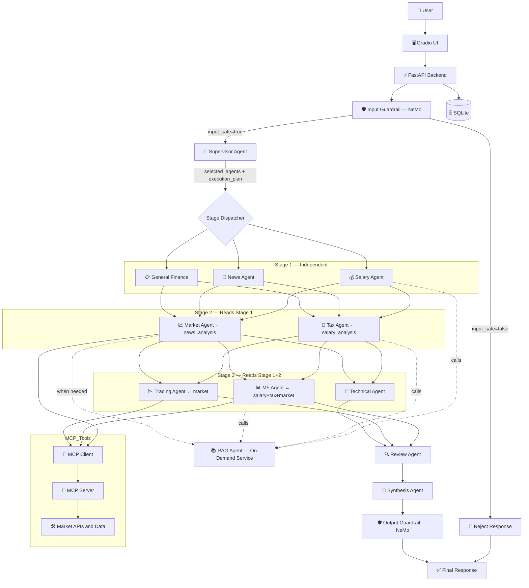

# FinSage AI: Multi-Agent Indian Financial Intelligence System

FinSage AI is an advanced multi-agent financial assistant for Indian users, built on a **Supervisor-planned, dependency-staged, guardrail-gated, review-gated architecture**. It answers practical questions on stocks, indices, mutual funds, tax, salary planning, insurance, loans, retirement, and trading using LangGraph orchestration, live market tools, and retrieval-augmented context.

The system uses a **Supervisor Agent** that dynamically selects which specialist agents to invoke, a **shared state communication bus** for inter-agent data flow, **NVIDIA NeMo Guardrails** for input/output safety, and a **Review Agent** that validates all outputs before final synthesis.

The project supports two execution styles:

1. Local multi-process mode: run FastAPI, MCP server, and Gradio separately.
2. Hugging Face Spaces single-entry mode: run app.py, which orchestrates all required services.

Important: this project is for educational and informational use only. It is not SEBI-registered investment advice.

## Features

- **Supervisor Agent** with LLM-based planning and dynamic agent selection (replaces keyword-based intent routing)
- **NVIDIA NeMo Guardrails** for input safety (blocks off-topic, prompt injection, toxic content) and output compliance (ensures disclaimers, blocks guaranteed return claims)
- **Dependency-aware 7-stage execution pipeline**: Input Guardrail → Supervisor → Stage 1 → Stage 2 → Stage 3 → Review → Synthesis → Output Guardrail
- **Shared state communication bus**: agents exchange structured data via `FinSageState` — no direct agent-to-agent calls
- **Review/Critic Agent** validates all outputs for contradictions, missing data, and plan completion before synthesis
- **On-demand RAG service** with domain-specific query expansion (Tax, Salary, MF, Market agents call RAG when needed)
- **Langfuse LLM Telemetry** integration for monitoring token usage, latency, tool calls, and LangGraph execution traces
- **Confidence blending**: 60% LLM self-assessment + 40% Review Agent score
- Multi-agent orchestration with LangGraph
- FastAPI backend with structured API responses
- Gradio chat UI with example prompts, confidence score, trace, and recent history
- MCP server integration for tool invocation
- Local persistence for query logs via SQLite

## High-Level Architecture



## Agent Communication (Shared State Bus)

Agents communicate exclusively through structured dicts in `FinSageState`. No direct agent-to-agent calls.

| State Key | Written By | Read By |
|-----------|-----------|--------|
| `input_safe` | Input Guardrail | Graph Router |
| `salary_analysis` | Salary Agent | Tax Agent, MF Agent |
| `tax_analysis` | Tax Agent | MF Agent |
| `news_analysis` | News Agent | Market Agent |
| `market_analysis` | Market Agent | Trading Agent, MF Agent |
| `review_output` | Review Agent | Synthesis Agent |
| `output_safe` | Output Guardrail | — |

### Execution Example

Query: `"I earn 12 LPA. How can I reduce taxes and invest wisely?"`

| Stage | Agents Run | Data Flow |
|-------|-----------|----------|
| Input Guardrail | NeMo Rails | checks query → `input_safe=true` |
| Supervisor | — | `selected_agents=["salary","tax","mutual_fund","market"]` |
| Stage 1 | Salary | writes `salary_analysis` |
| Stage 2 | Tax, Market | Tax reads `salary_analysis` |
| Stage 3 | MF | reads `salary_analysis` + `tax_analysis` + `market_analysis` |
| Review | Review | validates all outputs, scores confidence |
| Synthesis | Synthesis | combines everything into final recommendation |
| Output Guardrail | NeMo Rails | ensures disclaimer, checks compliance |

## Tech Stack

- Python 3.10+
- FastAPI + Uvicorn
- Gradio
- LangGraph + LangChain
- Groq API
- **NVIDIA NeMo Guardrails** (input/output safety rails)
- **Langfuse** (LLM Telemetry and Observability)
- MCP (SSE)
- FAISS + sentence-transformers
- SQLite + SQLAlchemy

## Repository Structure

```text
finsage/
    app.py                  # HF Spaces entrypoint (orchestrates MCP + backend + UI)
    main.py                 # FastAPI backend entrypoint
    mcp_server.py           # MCP server (NSE, Yahoo, MF, News tools)
    mcp_client.py           # Optional MCP test client
    mcp_bridge.py           # MCP tool bridge for agents
    mcp_runtime.py          # MCP session lifecycle manager
    requirements.txt

    agents/
        state.py            # FinSageState TypedDict (shared communication bus)
        graph.py            # LangGraph StateGraph (guardrail → supervisor → stages → review → synthesis → guardrail)
        input_guardrail_agent.py  # NeMo input safety gate (blocks off-topic, injection, toxic)
        output_guardrail_agent.py # NeMo output compliance gate (disclaimers, no guarantees)
        supervisor_agent.py # LLM-based planner and dynamic agent selector
        rag_agent.py        # On-demand RAG service with query expansion
        review_agent.py     # Critic that validates outputs before synthesis
        salary_agent.py     # Stage 1: writes salary_analysis
        news_agent.py       # Stage 1: writes news_analysis
        general_finance_agent.py  # Stage 1: writes general_finance_result
        tax_agent.py        # Stage 2: reads salary_analysis, writes tax_analysis
        market_agent.py     # Stage 2: reads news_analysis, writes market_analysis
        mutual_fund_agent.py # Stage 3: reads salary+tax+market, writes mf_analysis
        trading_agent.py    # Stage 3: reads market_analysis, writes trading_analysis_output
        technical_agent.py  # Stage 3: writes technical_analysis
        synthesis_agent.py  # Final: reads all outputs + review_output
        intent_agent.py     # [LEGACY] kept for reference, not in graph

    guardrails/             # NVIDIA NeMo Guardrails configuration
        config.yml          # Model config (Groq via OpenAI-compatible endpoint)
        config.py           # Environment setup for Groq API key
        rails.co            # Colang topical + safety rail definitions
        prompts.yml         # Self-check input/output prompt templates

    api/                    # FastAPI routes (/chat, /health, /history)
    config/                 # Settings and model config (Groq models)
    db/                     # SQLite database setup and CRUD
    frontend/               # Gradio UI implementation
    rag/                    # FAISS vector store + sentence-transformers embedder
    tools/                  # Financial tool integrations (NSE, Yahoo, MF, News, TA)
    scripts/                # Utility scripts (ingest_docs, test_query, test_guardrails, verify_imports)
```

## API Contract

Primary chat endpoint:

- POST /api/chat
- Request body:

```json
{
    "user_id": "string",
    "query": "string"
}
```

- Response body:

```json
{
    "answer": "string",
    "confidence": 0,
    "intent": "string",
    "trace": []
}
```


## Local Setup

### 1. Clone and enter project

```bash
cd "finance agent/finsage"
```

### 2. Create and activate virtual environment

Windows:

```powershell
python -m venv venv
.\venv\Scripts\Activate.ps1
```

Linux/macOS:

```bash
python3 -m venv venv
source venv/bin/activate
```

### 3. Install dependencies

```bash
pip install -r requirements.txt
```

### 4. Configure environment

Create .env in the project root:

```env
GROQ_API_KEY=gsk_your_key_here

# Optional: Langfuse Telemetry keys
LANGFUSE_PUBLIC_KEY=pk-lf-...
LANGFUSE_SECRET_KEY=sk-lf-...
LANGFUSE_HOST=https://cloud.langfuse.com
```

### 5. Build RAG index (first run only)

```bash
python scripts/ingest_docs.py
```

## Run Modes

### Mode A: Standard local (3 terminals)

Terminal 1 (backend):

```powershell
cd "e:\AI_Agent\finance agent\finsage"
venv\Scripts\Activate.ps1
python main.py
```

Terminal 2 (MCP server):

```powershell
cd "e:\AI_Agent\finance agent\finsage"
venv\Scripts\Activate.ps1
python mcp_server.py
```

Terminal 3 (Gradio UI):

```powershell
cd "e:\AI_Agent\finance agent\finsage"
venv\Scripts\Activate.ps1
python frontend/app.py
```

Open:

- UI: http://localhost:7860
- API docs: http://localhost:8000/docs
- Health: http://localhost:8000/api/health

### Mode B: Single-entry orchestrated run (recommended for HF Spaces)

```bash
python app.py
```

This starts:

1. MCP server (default port 7861)
2. FastAPI backend (default port 8000)
3. Gradio UI (default port 7860 or PORT env in Spaces)

## Hugging Face Spaces Deployment

Use Gradio Space with Python runtime.

### Required

1. Ensure app.py is the entrypoint in repository root.
2. Add secret:
     - GROQ_API_KEY
3. Keep requirements.txt updated.

### Recommended Space Variables

- PORT=7860
- MCP_PORT=7861
- BACKEND_HOST=127.0.0.1
- BACKEND_PORT=8000
- MCP_TRANSPORT=sse
- MCP_STARTUP_TIMEOUT=15
- BACKEND_STARTUP_TIMEOUT=25

Notes:

- If GROQ_API_KEY is missing, app.py now logs a warning and can still boot, but AI responses will fail until the secret is added.
- MCP_TRANSPORT=http is currently not supported by the included mcp_client.py path (SSE-only client code).

## MCP Usage

### Backend-integrated MCP

When the backend starts, it initializes an MCP client runtime and lists available tools.

Health endpoint shows MCP status:

- mcp_connected
- mcp_tools

### Optional manual MCP client

```bash
python mcp_client.py
```

One-shot query:

```bash
python mcp_client.py --query "What is the current stock price of TCS?"
```

## Troubleshooting

### Backend fails with GROQ_API_KEY validation error

Cause:

- Missing GROQ_API_KEY in environment or Space secrets.

Fix:

1. Add GROQ_API_KEY in .env (local) or Space Secrets (HF).
2. Restart the app.

### app.py fails with backend startup timeout

Cause:

- Backend crashed during import/startup.

Fix:

1. Check container logs for the first stack trace.
2. Verify GROQ_API_KEY is present.
3. Increase BACKEND_STARTUP_TIMEOUT if cold start is slow.

### UI loads but answers fail

Cause:

- Missing API key, MCP endpoint mismatch, or upstream tool issue.

Fix:

1. Check /api/health.
2. Confirm mcp_connected is true.
3. Verify MCP_SERVER_URL and MCP port values.

## Development Notes

- frontend/app.py contains create_ui(), used by both direct UI run and app.py orchestrator mode.
- app.py is intended for orchestrated startup in environments that only execute one entry file.
- main.py remains the standalone backend entrypoint.
- intent_agent.py is kept as legacy reference but is no longer wired into the graph.

## Architecture v3 Summary

The system was refactored from a simple `Intent → Route → Synthesize` pipeline to a guardrail-gated architecture:

```
Input Guardrail → [conditional] → Supervisor → Stage 1 → Stage 2 → Stage 3 → Review → Synthesis → Output Guardrail
                       ↓ (blocked)
                  Reject Response → END
```

Key design decisions:

- **NeMo Guardrails**: NVIDIA NeMo Guardrails with Colang topical rails + self-check prompts for input/output safety
- **Conditional routing**: Blocked queries skip the entire pipeline via LangGraph conditional edges, saving API tokens
- **Fail-open design**: If guardrails fail to load, the system continues working (allows queries, ensures disclaimers)
- **Supervisor over Intent**: LLM-based multi-agent selection instead of keyword routing
- **Staged execution**: Dependency-aware ordering ensures upstream data exists before downstream agents run
- **On-demand RAG**: Not a graph node — agents call `rag_agent.retrieve_for_agent()` only when they need knowledge context
- **Review gate**: Catches contradictions, missing data, and unsupported claims before synthesis
- **Confidence blending**: Final confidence = 60% LLM self-assessment + 40% Review Agent score

## License and Disclaimer

This project is provided for educational purposes. It does not provide certified financial advice. Always consult a qualified financial advisor before making investment decisions.
