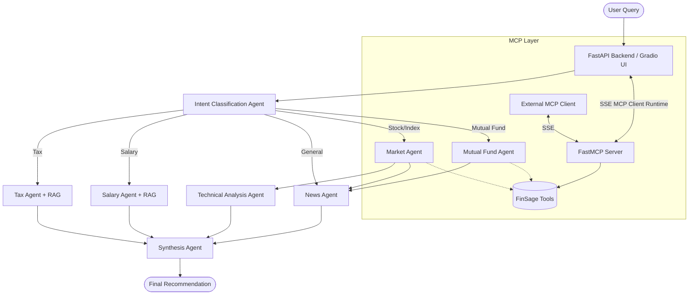

# 📈 FinSage AI — Indian Financial Assistant

**FinSage AI** is a multi-agent financial assistant built specifically for Indian users. Ask questions in plain English about stocks, market indices, mutual funds, salary planning, or taxes — and get real-time analysis with actionable recommendations. 

Additionally, FinSage now exposes its core tools via the **Model Context Protocol (MCP)**, allowing external agents and tools (like Claude Desktop) to connect securely and utilize FinSage's robust financial scraping and analysis tools.

Important integration detail: the FastAPI backend (`main.py`) now acts as the MCP client runtime. This means your backend automatically connects to `mcp_server.py` (if available) and uses MCP tools directly during normal Gradio requests.

> ⚠️ **Disclaimer:** This is an educational project. Not SEBI-registered investment advice. Always consult a qualified financial advisor before making investment decisions.

---

## 🎯 What It Does

| Query Type | Example | What Happens |
|---|---|---|
| **Salary Planning** | "My salary is ₹20,000. How should I manage?" | Budget breakdown with PPF, ELSS, SIP recommendations |
| **Stock Analysis** | "Should I buy Reliance now?" | Live price + Technical analysis + News sentiment + Recommendation |
| **Index Analysis** | "Nifty at 22,400 — buy or wait?" | Index data + EMA/RSI/MACD analysis + Trading signal |
| **Mutual Funds** | "How is Parag Parikh Flexi Cap performing?" | Fetches NAV, returns, and historical performance |
| **Tax Calculation** | "Sold TCS after 8 months with ₹50K profit. Tax?" | STCG/LTCG calculation with optimization tips |
| **MCP Integration** | Connect from any MCP client | Serves financial tools securely over SSE |

---

## 🏗️ Architecture

FinSage utilizes a multi-agent orchestration framework (LangGraph) backed by multiple specialized tools and RAG systems. MCP is integrated in two ways:

- Internal: backend (`main.py`) connects as MCP client and calls tools during API requests.
- External: optional clients can connect directly to `mcp_server.py` for testing/integration.



**7 AI agents** orchestrated by **LangGraph**, powered by **Groq models**:
- `llama-3.1-8b-instant` — Fast classification & sentiment
- `llama-3.3-70b-versatile` — Market analysis, planning, synthesis
- `qwen-qwq-32b` — Step-by-step math reasoning (tax, technical analysis)

---

## 📁 Folder Structure

```
finsage/
├── .env                          ← Your Groq API key
├── requirements.txt              ← All Python dependencies
├── main.py                       ← FastAPI server entry point
├── mcp_server.py                 ← Model Context Protocol Server
├── mcp_client.py                 ← Interactive MCP Client
├── README.md                     ← This documentation
│
├── config/
│   ├── settings.py               ← App configuration
│   └── models.py                 ← Groq model routing constants
│
├── agents/                       ← LangGraph AI Agents
│   ├── graph.py                  ← Orchestration logic
│   ├── intent_agent.py           ← Classification
│   ├── market_agent.py           ← Stock/Index logic
│   ├── mutual_fund_agent.py      ← Mutual funds logic
│   ├── tax_agent.py              ← Tax calculation logic
│   ├── salary_agent.py           ← Budget planning logic
│   ├── technical_agent.py        ← Indicator math
│   ├── news_agent.py             ← Sentiment scoring
│   ├── synthesis_agent.py        ← Final response builder
│   └── state.py                  ← Graph state definitions
│
├── tools/                        ← Data fetching utilities
│   ├── nse_tool.py               ← Live NSE scraping
│   ├── yahoo_tool.py             ← Yahoo Finance wrapper
│   ├── mf_tool.py                ← AMFI Mutual fund data
│   ├── news_tool.py              ← RSS news aggregation
│   └── technical_tool.py         ← Technical indicators (EMA, MACD, RSI)
│
├── rag/                          ← Local RAG System
│   ├── embedder.py               ← sentence-transformers
│   ├── knowledge_base.py         ← FAISS vector database wrapper
│   ├── faiss.index               ← FAISS index (generated)
│   └── docs/                     ← Core knowledge text files
│
├── db/                           ← SQLite Storage
│   └── database.py, models.py    ← Logging infrastructure
│
├── api/                          ← FastAPI Endpoints
│   └── routes.py                 
│
├── frontend/                     ← Gradio UI
│   └── app.py                    
│
└── scripts/
    ├── ingest_docs.py            ← Build the FAISS database
    └── test_query.py             ← Test runner
```

---

## 🚀 Step-by-Step Setup Guide

### Step 1: Prerequisites & Cloning
Ensure you have **Python 3.10+** installed and you've acquired a free API key from [Groq Console](https://console.groq.com).

Clone or navigate into the project directory:
```bash
cd "finance agent/finsage"
```

### Step 2: Create a Virtual Environment
**Windows:**
```powershell
python -m venv venv
.\venv\Scripts\Activate.ps1
```

**macOS / Linux:**
```bash
python3 -m venv venv
source venv/bin/activate
```

### Step 3: Install Dependencies
Install all required packages (including FastAPI, Gradio, LangGraph, and MCP):
```bash
pip install -r requirements.txt
```
*(Note: First install may take a few minutes).*

### Step 4: Configure API Keys
Create a `.env` file in the root `finsage/` folder and add your Groq API key:
```env
GROQ_API_KEY=gsk_your_actual_key_here
```

### Step 5: Build the Knowledge Base
Download the embedding model and convert the financial rules into a FAISS vector database. You only need to run this once:
```bash
python scripts/ingest_docs.py
```

### Step 6: Start the AI Backend
Run the FastAPI backend server to serve the agents:
```bash
cd finsage
venv\Scripts\Activate.ps1
python main.py
```
*The server will run on `http://localhost:8000`. You can view the API docs at `http://localhost:8000/docs`.*

### Step 7: Start the Gradio Frontend
Open a **new terminal**, activate the virtual environment, and run the frontend:
```bash
cd finsage
venv\Scripts\Activate.ps1
python frontend/app.py
```
*Your browser will open automatically to `http://localhost:7860` where you can chat with FinSage.*

---

## 🔌 Running the MCP Integration (Proper Flow)

FinSage includes an MCP server and an integrated MCP client inside backend startup.

- Required for MCP-enabled app flow: run `mcp_server.py`.
- `main.py` automatically connects to MCP server and reuses that session for agent tool calls.
- `mcp_client.py` is optional and only needed for manual MCP testing.

### Start the MCP Server
In your activated virtual environment, start the MCP server which will run continuously over SSE on port 8001:
```bash
cd finsage
venv\Scripts\Activate.ps1
python mcp_server.py
```

### Start the MCP Client (Optional)
Open a **new terminal window**, activate your virtual environment, and run the client only when needed:
```bash
cd finsage
venv\Scripts\Activate.ps1
python mcp_client.py
```

Run one-shot mode (no interactive terminal loop):
```bash
cd finsage
venv\Scripts\Activate.ps1
python mcp_client.py --query "What is the current stock price of TCS?"
```

You will see:
```text
Connected to server with tools: ['nse_quote', 'stock_data', 'company_profile', 'intraday_data', 'options_chain', 'mf_details']

MCP Client Started!
Type your queries or 'quit' to exit.

Query: 
```

Try asking: *"What is the current stock price of TCS?"*. The client uses Groq to understand your request, invoke the `stock_data` MCP tool on the server, and synthesize the result back to you.

### Full Recommended Run Order (Windows)
Use separate terminals in this order (only 3 needed):

1. Terminal 1 (backend)
```powershell
cd "e:\AI_Agent\finance agent\finsage"
venv\Scripts\Activate.ps1
python main.py
```

2. Terminal 2 (frontend)
```powershell
cd "e:\AI_Agent\finance agent\finsage"
venv\Scripts\Activate.ps1
python frontend/app.py
```

3. Terminal 3 (MCP server, optional but recommended for MCP-integrated tool path)
```powershell
cd "e:\AI_Agent\finance agent\finsage"
venv\Scripts\Activate.ps1
python mcp_server.py
```

`mcp_client.py` is optional test tooling only and is not required for Gradio + backend operation.

### Verify MCP Connection
Check backend health endpoint after starting all services:

`http://localhost:8000/api/health`

Expected fields in response:

- `mcp_connected: true`
- `mcp_tools: [...]`

---
*Built with ❤️ using Groq, LangGraph, FastAPI, MCP, and Gradio*
